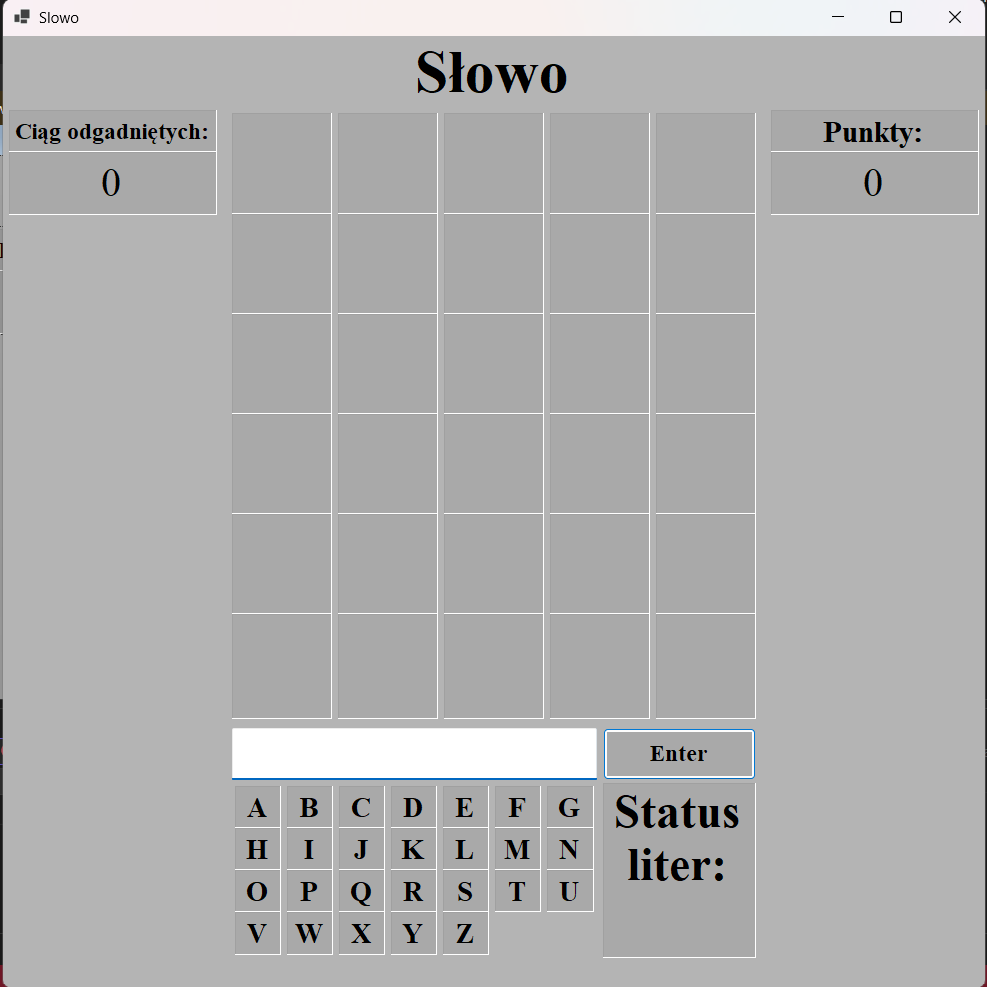

# Slowo
> Prosta gra polegająca na zgadywaniu słów pięcioliterowych w co najwyżej 6 próbach.

## Spis treści
* [Informacje Generalne](#informacje-generalne)
* [Technologie](#technologie)
* [Funkcje](#funkcje)
* [Zdjęcia](#zdjęcia)
* [Jak uruchomić projekt](#jak-uruchomić-projekt)
* [Inspiracja](#inspiracja)
* [Możliwe ulepszenia](#możliwe-ulepszenia)
* [Kontakt](#kontakt)

## Informacje Generalne
- Program ten polega na zgadywaniu pięciliterowych słów.
- Użytkownik ma sześć prób, w których może zgadnąć dane słowo.
- Za każdą nieudaną próbą gra informuje go o tym, czy użyte w danym podejściu litery:
  1. znajdują się w słowie-odpowiedzi w odpowiednim miejscu (kolor zielony);
  2. znajdują się w słowie-odpowiedzi, ale w innym miejscu (kolor żółty);
  3. nie znajdują się w słowie-odpowiedzi (kolor czerwony).
- Po wykorzystaniu wszystkich możiwych prób przez użytkownika, wyskakuje okienko z informacją o niepowodzeniu oraz tym jakie słowo było poprawne.
- Za każdym razem kiedy użytkownik odgadnie dane słowo, zwiększa się liczba odgadniętych słów pod rząd oraz zostaje on nagrodzony adekwatną liczbą punktów
- Na dole ekranu znajdue się okienko informujące o statusie danej litery (szare, zielone, żółte i czerwone)

## Technologie
Wykorzystene technologie:
- Windows Forms (WinForms)
- .Net 8.0
- HTTP/REST + JSON (Web API)
Wykorzystane API:
- [Free Dictionary API](https://dictionaryapi.dev) twórca: [@meetDeveloper](https://github.com/meetDeveloper)
- [Free Random Word Generator API](https://random-word-api.vercel.app)

## Funkcje
Program ten jest zdolny do:
- Wylosowania słowa w języku angielskim przy uruchomieniu jak i przy odgadnięciu poprzedniego słowa
- Sprawdzenia czy dane słowo znajduje się w słowniku języka angielskiego
- Sprawdzenia czy dane słowo nie przekracza lub nie jest krótsze od 5 liter

## Zdjęcia

<!-- If you have screenshots you'd like to share, include them here. -->

## Jak uruchomić projekt?
Wymagania wstępne:
- Zainstalowany **.NET SDK 8.0 lub wyższy**
- Visual Studio 2022+
- System Windows
Następnie sklonuj repozytorium.

## Inspiracja
Inspiracją projektu była gra przeglądarkowa stworzona przez Josha Wardle’a o nazwie Wordle.

## Możliwe ulepszenia
Pod wieloma aspektami produkt ostateczny jest tym czym chciałem żeby był. Jednak nie oznacza to tego, że są rzeczy, których nie dało by się ulepszyć:

Możliwe ulepszenia:
- Ulepszenie aspektu wizualnego przez dodanie zdjęć lub zmienienie kolorystyki.
- Dodanie użytkownikowi opcji zgadywania słów podanych przez niego.
- Dodanie większego katalogu słów do zgadywania przez dodanie słów w języku Polskim jako dodatkowa opcja rozgrywki.

## Kontakt
Stworzone przez [@pleibrandt](https://github.com/pleibrandt)
